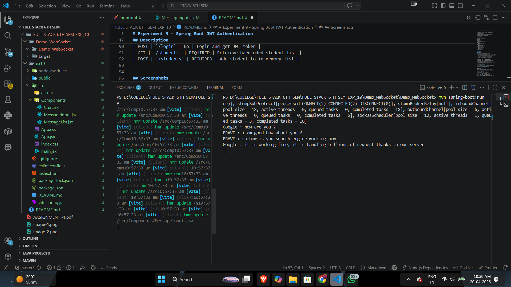
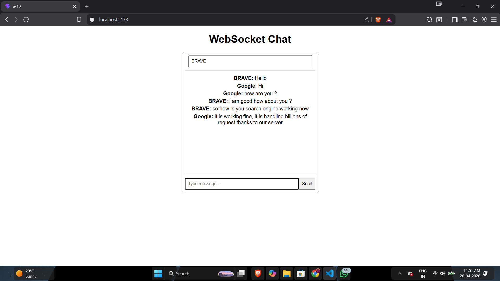

# Experiment 10 - # WebSocket Chat Application

## Overview

This project is a real-time chat application built using:

* **Frontend:** React (Vite)
* **Backend:** Spring Boot with WebSocket (STOMP over SockJS)

It allows multiple users to send and receive messages instantly using a publish-subscribe messaging model.

---

## Features

* Real-time messaging using WebSockets
* Username-based message identification
* Automatic message updates without page refresh
* Enter key + button support for sending messages
* Reconnection support via STOMP client

---

## Tech Stack

### Frontend

* React
* Vite
* sockjs-client
* @stomp/stompjs

### Backend

* Spring Boot
* Spring WebSocket
* STOMP Protocol

---

## Project Structure

### Frontend (React)

```
src/
 ├── Components/
 │   ├── Chat.jsx
 │   ├── MessageInput.jsx
 │   └── MessageList.jsx
 ├── App.jsx
 └── App.css
```

### Backend (Spring Boot)

```
com.aml2b.Demo_WebSocket/
 └── DemoWebSocketApplication.java
```

---

## How It Works

1. Client connects to WebSocket endpoint:

   ```
   http://localhost:8080/ws
   ```

2. Messages are sent to:

   ```
   /app/chat
   ```

3. Messages are broadcast to:

   ```
   /topic/messages
   ```

4. All connected clients subscribed to `/topic/messages` receive updates instantly.

---

## Installation & Setup

### 1. Clone the repository

```
git clone <your-repo-url>
cd <project-folder>
```

---

### 2. Backend Setup (Spring Boot)

Make sure you have:

* Java 17 or 21
* Maven installed

Run:

```
mvn clean install
mvn spring-boot:run
```

Server runs on:

```
http://localhost:8080
```

---

### 3. Frontend Setup (React)

Navigate to frontend folder:

```
cd <frontend-folder>
```

Install dependencies:

```
npm install
```

Run development server:

```
npm run dev
```

App runs on:

```
http://localhost:5173
```

---

## Usage

1. Enter your username
2. Type a message
3. Press **Enter** or click **Send**
4. Messages appear in real-time for all connected users

---

## Important Notes

* Backend must be running before frontend connects
* WebSocket endpoint must match (`/ws`)
* If connection fails, check CORS and port configuration
* Do not run backend using raw `java` command — use Maven

---

## Limitations

* No authentication (anyone can join with any name)
* No message persistence (refresh = messages lost)
* No user session handling
* No scalability handling (basic implementation)

---

## Future Improvements

* Add authentication (JWT / session-based)
* Store messages in database
* Add private messaging
* Improve UI/UX
* Add typing indicators
* Deploy backend and frontend

---

## Author

Aditya

## Screenshots





